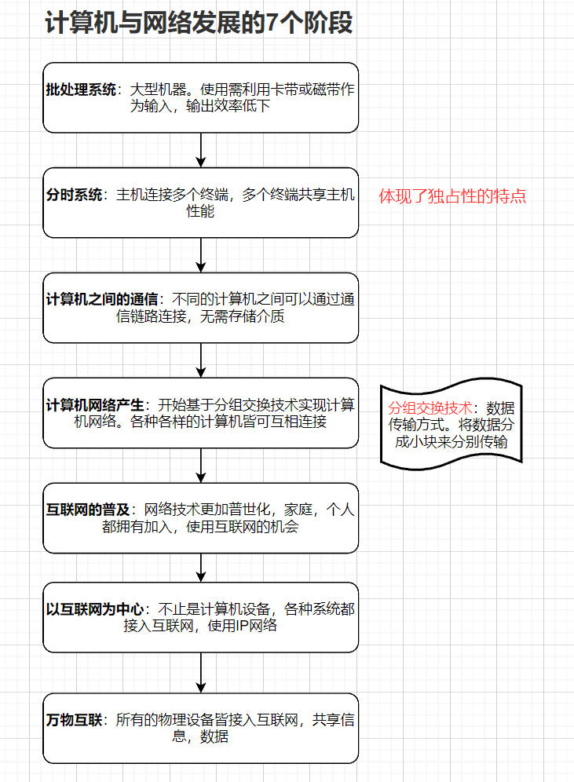

# 1. 网络基础知识

## 1.1 计算机网络出现背景

​	计算机诞生之初，经作为单机使用。那么随着计算机成本下降，使用人数增多，使用场景增加。便出现希望计算机之间可以直接交流的需求。而后需求扩大，机构，区域，城市，国家，乃至全世界的计算机皆可互相访问，连接，终而形成计算机的网络。

> - **计算机使用模式的转换称为**：单机模式 --->  网络互联模式
> - **计算机网络的规模划分**：LAN -- Local Area Network（局域网）。MAN -- Metropolitan Area Network （城域网）WAN --  Wide Area Network（广域网）。

## 1.2 计算机与网络发展的7个阶段

如何使所有的物理设备都接入互联网，共享信息，这离不开TCP/IP协议的帮助，在了解它前，先理解什么叫协议。

## 1.3 协议

**协议**：即计算机中的语言，如果计算机之间的交流遵循着同一协议，那么它们之间就满足交流的基础。

**所以**：协议也就是一个约定，不同的计算机设备按照同一约定交流数据。

## 1.4 协议由谁来制定

最初。协议的标准化没受重视，可以说每家厂商都具有自己的协议，这导致不同厂商的设备之间无法通信。

为了解决这个问题：

1. ISO机构推出了OSI模型。这种模型虽然没有直接广泛使用，但为后续的协议作出了重要的指导作用
2. 最广泛使用的通信协议是IETF推出的TCP/IP协议
3. 不同的计算机厂商都使其设备支持TCP/IP协议，从而使计算机之间都满足通信条件

## 1.5 协议的分层设计与OSI参考模型

OSI参考模型将通信协议制定成了7层架构：

