# HTML 知识记录

## 一，HTML 简介 

### 1. 什么是 HTML？ 

全称：HyperText Markup Language（超文本标记语言）。

> **超文本：**暂且简单理解为 “超级的文本”，和普通文本比，内容更丰富。
> **标 记：**文本要变成超文本，就需要用到各种标记符号。
> **语 言：**每一个标记的写法、读音、使用规则，组成了一个标记语言。

### **2. 相关国际组织（了解）**

1. **IETF**

> 全称：Internet Engineering Task Force（国际互联网工程任务组），成立于1985年底，是一个权威的互联网技术标准化组织，主要负责互联网相关技术规范的研发和制定，当前绝大多数国际互联网技术标准均出自IETF。官网：[https://www.ietf.org](https://www.ietf.org/)

3. **W3C**

> 全称：World Wide Web Consortium（万维网联盟），创建于1994年，是目前Web技术领域，最具影响力的技术标准机构。共计发布了200多项技术标准和实施指南，对互联网技术的发展和应用起到了基础性和根本性的支撑作用，官网：[https://www.w3.org](https://www.w3.org/)

3. **WHATWF**

> 全称：Web Hypertext Application Technology Working Group（网页超文本应用技术工作小组）成立于2004年，是一个以推动网络HTML 5 标准为目的而成立的组织。由Opera、Mozilla基金会、苹果，等这些浏览器厂商组成。官网：https://whatwg.org/

### 3. HTML 发展历史（了解） 

从 HTML 1.0 开始发展，期间经历了很多版本，目前HTML的最新标准是：HMTL 5，具体发展史如图（了解即可）。

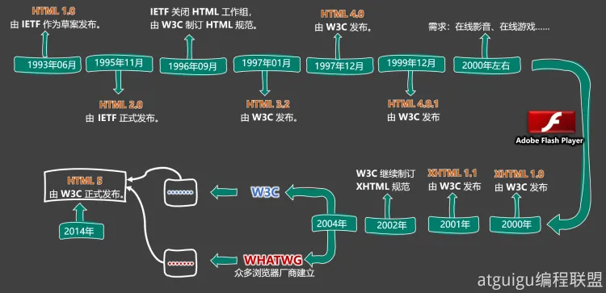

## 二，HTML 入门知识

### 1. HTML 文档声明

1. **作用**：告诉浏览器当前网页的版本

2. 写法：

   - **旧写法**：根据版本而定，具体参考[W3C官网-文档声明](https://www.w3.org/QA/2002/04/valid-dtd-list.html)

   - **新写法**：推荐写法

     ```HTML
     <!DOCTYPE html>  
         或  
     <!DOCTYPE HTML>
         或  
     <!doctype html>
     ```

3. **注意**：文档声明，必须写字网页的第一行，且在`html`标签的外侧

 

### 2. HTML 字符编码

1. 计算机对数据的操作：

   - 存储时，对数据进行：**编码**。

   - 读取时，对数据进行：解码。

2. 编码、解码，会遵循一定的规范 —— **字符集**。

3. 字符集有很多中，常见的有（了解）：

   - ASCII：大写字母、小写字母、数字、一些符号，共计128个。
   - ISO 8859-1：在 ASCII 基础上，扩充了一些希腊字符等，共计是256个。
   - GB2312：继续扩充，收录了 6763 个常用汉字、682个字符。
   - GBK：收录了的汉字和符号达到 20000+ ，支持繁体中文。
   - UTF-8 ：包含世界上所有语言的：所有文字与符号。—— 很常用。 

4. 使用原则是怎样的

   > 原则1：存储时，务必采用合适的字符编码 。
   > 否则：无法存储，数据会丢失！

   > 原则2：存储时采用哪种方式编码 ，读取时就采用哪种方式解码。
   > 否则：数据错乱（乱码）！

   例如下面文字中，包含有：中文、英文、泰文、缅甸文

   ```
   我爱你
   I love you!
   ฉันรักเธอนะ
   ကျွန်မကို ချစ်တယ်။
   ```

   > 若使用 ISO8859-1 编码存储，在存入的那一刻，就出问题了，因为ISO8859-1仅支持英文！
   > 为保证所有的输入，都能正常存储和读取，现在几乎全都采用：UFT-8编码。
   > 所以我们编写html文件时，也都统一用UFT-8编码。

5. 总结：

   - 平时编写代码时，统一采用UTF-8编码（最稳妥）。

   - 为了让浏览器在渲染html文件时不犯错误，可以通过meta标签配合charset属性指定字符编码。

     ```html
     <head>
         <meta charset="UTF-8"/>
     </head>
     ```

### 3. HTML 设置语言 

1. 主要作用：

   ✅让浏览器显示对应的翻译提示。

   ✅有利于搜索引擎优化。

2. 具体写法：

   ```html
   <html lang="zh-CN">
   ```

3. 扩展知识：lang属性的编写规则（作为一个课外扩展知识，了解即可）。

> 第一种写法（ 语言-国家/地区 ），例如：
>
> - zh-CN ：中文-中国大陆（简体中文）
> - zh-TW ：中文-中国台湾（繁体中文）
> - zh ：中文
> - en-US ：英语-美国
> - en-GB ：英语-英国
>
> - 第二种写法（ 语言—具体种类）已不推荐使用，例如：
>
>   - zh-Hans ：中文—简体
>
>   - zh-Hant ：中文—繁体
>
> - W3School 上的说明：[《语言代码参考手册》](https://www.w3school.com.cn/tags/html_ref_language_codes.asp)、[《国家/地区代码参考手册》](https://www.w3school.com.cn/tags/html_ref_country_codes.asp)
>
> - W3C官网上的说明：[《Language tags in HTML》](https://www.w3.org/International/articles/language-tags/)

## 三，基础HTML标签

### 1. 语义化标签

- **概念**：用特定的标签，去表达特定的含义。
- **原则**：标签的默认效果不重要（后期可以通过CSS随便控制效果），语义最重要！
- **举例**：对于h1标签，效果是文字很大（不重要），语义是网页主要内容（很重要）。
- **优势：**
  1. 代码结构清晰可读性强。
  2. 有利于 SEO（搜索引擎优化）。
  3. 方便设备解析（如屏幕阅读器、盲人阅读器等）。


### 2. 块级元素 与 行内元素

1. **块级元素**：独占一行
2. **行内元素**：不独占一行
3. **使用原则**：
   - 块级元素 中能写 行内元素 和 块级元素（简单记：块级元素中几乎什么都能写）。
   - 行内元素 中能写 行内元素，但不能写 块级元素。
   - 行内元素 中能写 行内元素，但不能写 块级元素。
     - h1~h6 不能互相嵌套。
     - p中不要写块级元素。

### 3. 常用的文本标签

1. 用于包裹：词汇、短语等。 
2. 通常写在排版标签里面。
3. 排版标签更宏观（大段的文字），文本标签更微观（词汇、短语）。
4. 文本标签通常都是行内元素。

| **标签名** |           **标签语义**           | **单 / 双 标签** |
| :--------: | :------------------------------: | :--------------: |
|    `em`    |         要着重阅读的内容         |        双        |
|  `strong`  |  十分重要的内容（语气比em要强）  |        双        |
|   `span`   | 没有语义，用于包裹短语的通用容器 |        双        |

### 4. 图片标签

| **标签名** | 标签语义 |                         **常用属性**                         | **单 / 双 标签** |
| :--------: | :------: | :----------------------------------------------------------: | :--------------: |
|   `img`    |   图片   | `src` ：图片路径（又称：图片地址）—— 图片的具体位置 `alt` ：图片描述 `width` ：图片宽度，单位是像素，例如：200px 或 200height ：图片高度， 单位是像素，例如：200px 或 200 |        单        |

总结：

> 1. 尽量不同时修改图片的宽和高，可能会造成比例失调。
> 2. `alt`属性的作用：
>    - 搜索引擎通过`alt`属性，得知图片的内容。—— 最主要的作用。
>    - 当图片无法展示时候，有些浏览器会呈现`alt`属性的值。
>    - 盲人阅读器会朗读`alt`属性的值

### 5. 超链接

主要作用：从当前页面进行跳转。

可以实现：

1. 跳转到指定页面
2. 跳转到指定文件（也可触发下载）
3. 跳转到锚点位置
4. 唤起指定应用。

| **标签名** | **标签语义** |                         **常用属性**                         | **单 / 双 标签** |
| :--------- | :----------: | :----------------------------------------------------------: | :--------------: |
| a          |    超链接    | 1. `href` ： 指定要跳转到的具体目标。<br />2. `target` ： 控制跳转时如何打开页面，常用值如下:_self ：在本窗口打开。_blank ：在新窗口打开。<br />3. `id` ： 元素的唯一 标识，可用于设置锚点。<br />4. `name` ： 元素的名字，写在a标签中，也能设置锚点。 |        双        |


#### 1. 跳转到页面

```HTML
<!-- 跳转其他网页 -->
<a href="https://www.jd.com/" target="_blank">去京东</a>

<!-- 跳转本地网页 -->
<a href="./10_HTML排版标签.html" target="_self">去看排版标签</a>
```

注意点：

1. 虽然a是行内元素，但a元素可以包裹除它自身外的任何元素！
2. 代码中的多个空格、多个回车，都会被浏览器解析成一个空格！

#### 2. 跳转到文件

```html
<!-- 浏览器能直接打开的文件 -->
<a href="./resource/自拍.jpg">看自拍</a>
<a href="./resource/小电影.mp4">看小电影</a>
<a href="./resource/小姐姐.gif">看小姐姐</a>
<a href="./resource/如何一夜暴富.pdf">点我一夜暴富</a>

<!-- 浏览器不能打开的文件，会自动触发下载 -->
<a href="./resource/内部资源.zip">内部资源</a>

<!-- 强制触发下载 -->
<a href="./resource/小电影.mp4" download="电影片段.mp4">下载电影</a>
```

注意1：若浏览器无法打开文件，则会引导用户下载。

注意2：若想强制触发下载，请使用`download`属性，属性值即为下载文件的名称。

#### 3. 跳转到锚点

什么是锚点？—— 网页中的一个标记点，具体使用方式如下：

**第一步：设置锚点**

```html
<!-- 第一种方式：a标签配合name属性 -->
<a name="test1"></a>

<!-- 第二种方式：其他标签配合id属性 -->
<h2 id="test2">我是一个位置</h2>
```

注意点：

> - 具有 `href` 属性的 a标签是超链接，具有 `name` 属性的 a标签是锚点。
> - `name`和`id`都是区分大小写的，且id最好别是数字开头。

**第二步：跳转锚点**

```html
<!-- 跳转到test1锚点-->
<a href="#test1">去test1锚点</a>

<!-- 跳到本页面顶部 -->
<a href="#">回到顶部</a>

<!-- 跳转到其他页面锚点 -->
<a href="demo.html#test1">去demo.html页面的test1锚点</a>

<!-- 刷新本页面 -->
<a href="">刷新本页面</a>

<!-- 执行一段js,如果还不知道执行什么，可以留空，javascript:; -->
<a href="javascript:alert(1);">点我弹窗</a>
```

#### 4. 唤起指定应用

通过a标签，可以唤起设备应用程序。

```html
<!-- 唤起设备拨号 -->
<a href="tel:10010">电话联系</a>
<!-- 唤起设备发送邮件 -->
<a href="mailto:10010@qq.com">邮件联系</a>
<!-- 唤起设备发送短信 -->
<a href="sms:10086">短信联系</a>
```

### 6. 列表

#### 1. 有序列表

概念：有顺序或侧重顺序的列表。

```html
<h2>要把大象放冰箱总共分几步</h2>
<ol>
    <li>把冰箱门打开</li>
    <li>把大象放进去</li>
    <li>把冰箱门关上</li>
</ol>
```

#### 2. 无序列表

概念：无顺序或不侧重顺序的列表。

```html
<h2>我想去的几个城市</h2>
<ul>
    <li>成都</li>
    <li>上海</li>
    <li>西安</li>
    <li>武汉</li>
</ul>
```

#### 3. 列表嵌套

概念：列表中的某项内容，又包含一个列表（注意：嵌套时，请务必把解构写完整）。

```html
<h2>我想去的几个城市</h2>
<ul>
    <li>成都</li>
    <li>
        <span>上海</span>
        <ul>
            <li>外滩</li>
            <li>杜莎夫人蜡像馆</li>
            <li>
                <a href="https://www.opg.cn/">东方明珠</a>
            </li>
            <li>迪士尼乐园</li>
        </ul>
    </li>
    <li>西安</li>
    <li>武汉</li>
</ul>
```

注意：`li` 标签最好写在 `ul` 或 `ol` 中，不要单独使用。

#### 4. 自定义列表

1. 概念：所谓自定义列表，就是一个包含术语名称以及术语描述的列表。
2. 一个`dl`就是一个自定义列表，一个`dt`就是一个术语名称，一个`dd`就是术语描述（可以有多个）。

```html
<h2>如何高效的学习？</h2>
<dl>
    <dt>做好笔记</dt>
    <dd>笔记是我们以后复习的一个抓手</dd>
    <dd>笔记可以是电子版，也可以是纸质版</dd>
    <dt>多加练习</dt>
    <dd>只有敲出来的代码，才是自己的</dd>
    <dt>别怕出错</dt>
    <dd>错很正常，改正后并记住，就是经验</dd>
</dl>
```

### 7. 表格

#### 1. 基本结构

1. 一个完整的表格由：**表格标题、表格头部、表格主体、表格脚注**，四部分组成。

   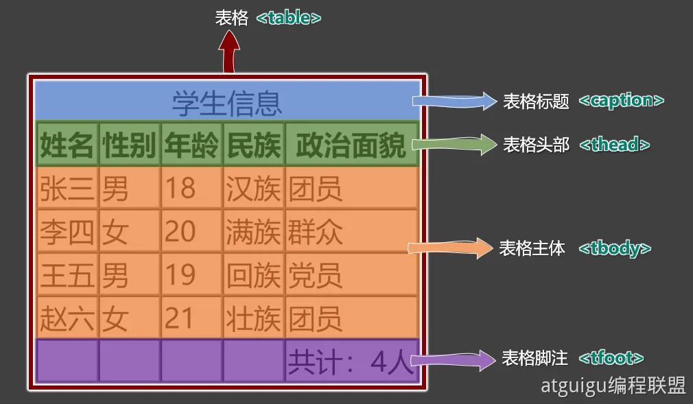

2. 表格涉及到的标签：

   - `table`：表格

   - `caption` ：表格标题

   - `thead` ：表格头部

   - `tbody`：表格主体

   - `tfoot`：表格注脚

   - `tr`：每一行

   - `th`、`td`：每一个单元格（备注：表格头部中用th，表格主体、表格脚注中用：td）

     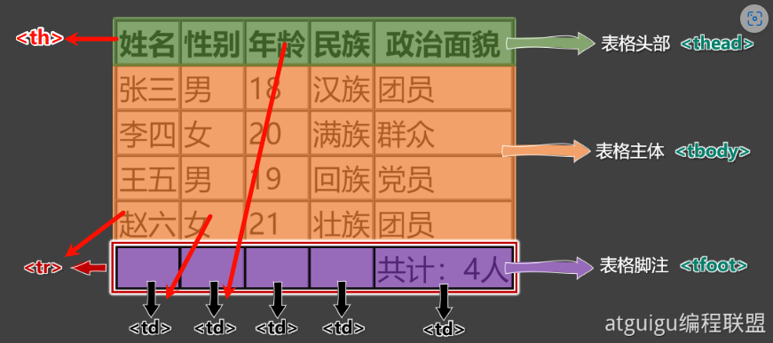

3. 具体编码

   ```html
   <table border="1">
       <!-- 表格标题 -->
       <caption>学生信息</caption>
       <!-- 表格头部 -->
       <thead>
           <tr>
               <th>姓名</th>
               <th>性别</th>
               <th>年龄</th>
               <th>民族</th>
               <th>政治面貌</th>
           </tr>
       </thead>
       <!-- 表格主体 -->
       <tbody>
           <tr>
               <td>张三</td>
               <td>男</td>
               <td>18</td>
               <td>汉族</td>
               <td>团员</td>
           </tr>
           <tr>
               <td>李四</td>
               <td>女</td>
               <td>20</td>
               <td>满族</td>
               <td>群众</td>
           </tr>
           <tr>
               <td>王五</td>
               <td>男</td>
               <td>20</td>
               <td>回族</td>
               <td>党员</td>
           </tr>
           <tr>
               <td>赵六</td>
               <td>女</td>
               <td>21</td>
               <td>壮族</td>
               <td>团员</td>
           </tr>
       </tbody>
       <!-- 表格脚注 -->
       <tfoot>
           <tr>
               <td></td>
               <td></td>
               <td></td>
               <td></td>
               <td>共计：4人</td>
           </tr>
       </tfoot>
   </table>
   ```

   #### 2. 常用属性

| **标签名** | **标签语义** | **常用属性**                                                 | **单 / 双** |
| ---------- | ------------ | ------------------------------------------------------------ | ----------- |
| `table`    | 表格         | 1 `width`：设置表格宽度。<br/>2 `height`：设置表格最小高度，表格最终高度可能比设置的值大。<br/>3 `border` ：设置表格边框宽度。<br/>4 `cellspacing`： 设置单元格之间的间距。 | 双          |
| `thead`    | 表格头部     | 1 `height`：设置表格头部高度。<br/>2 `align`： 设置单元格的水平对齐方式，可选值如下：              <br/>`left`：左对齐              <br/>`center`：中间对齐              <br/>`right`：右对齐<br/>3 `valign`：设置单元格的垂直对齐方式，可选值如下：              <br/>`top`：顶部对齐              <br/>`middle`：中间对齐              <br/>`bottom`：底部对齐 | 双          |
| `tbody`    | 表格主体     | 常用属性与`thead`相同。                                      | 双          |
| `tr`       | 行           | 常用属性与`thead`相同。                                      | 双          |
| `tfoot`    | 表格脚注     | 常用属性与`thead`相同                                        | 双          |
| `td`       | 普通单元格   | 1 `width`：设置单元格的宽度，同列所有单元格全都受影响。<br/>2 `heigth`：设置单元格的高度，同行所有单元格全都受影响。<br/>3 `align`：设置单元格的水平对齐方式。<br/>4 `valign`：设置单元格的垂直对齐方式。<br/>5 `rowspan`：指定要跨的行数。<br/>6 `colspan`：指定要跨的列数。 | 双          |
| `th`       | 表头单元格   | 常用属性与`td`相同                                           | 双          |

注意点：

> 1. \<`table`>元素的`border`属性可以控制表格边框，但`border`值的大小，并不控制单元格边框的宽度，只能控制表格最外侧边框的宽度，这个问题如何解决？—— 后期靠`CSS`控制。
> 2. 默认情况下，每列的宽度，得看这一列单元格最长的那个文字。
> 3. 给某个`th`或`td`设置了宽度之后，他们所在的那一列的宽度就确定了。
> 4. 给某个`th`或`td`设置了高度之后，他们所在的那一行的高度就确定了。

#### 3.跨行跨列

1. `rowspan`：指定要跨的行数。
2. `colspan`：指定要跨的列数

课程表效果：

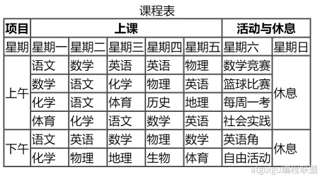

编写思路：

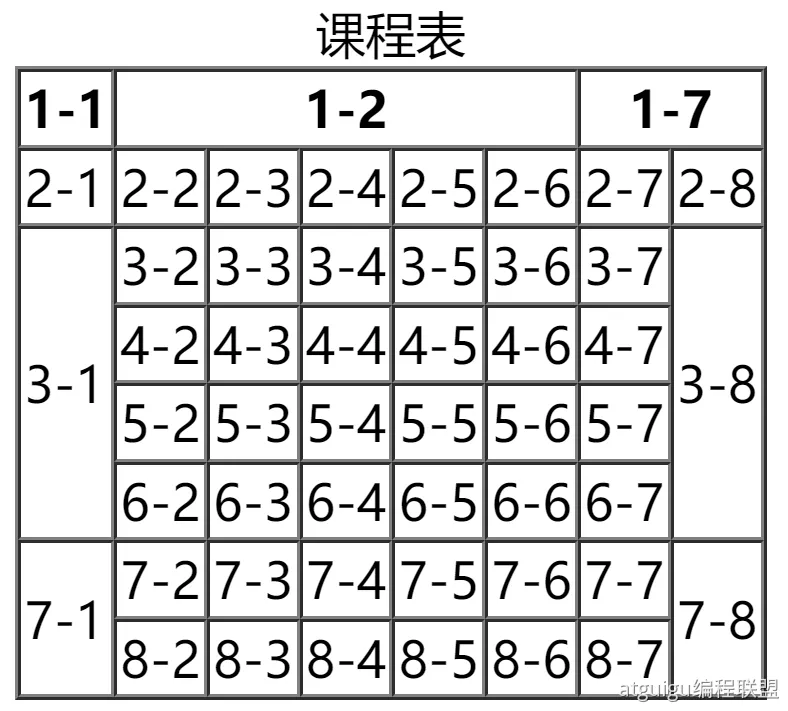

#### 4. 常用标签补充

| **标签名** |                **标签含义**                | **单 / 双 标签** |
| :--------: | :----------------------------------------: | :--------------: |
|    `br`    |                    换行                    |        单        |
|    `hr`    |                    分隔                    |        单        |
|   `pre`    | 按原文显示（一般用于在页面中嵌入大段代码） |        双        |

注意点：

> 1. 不要用 \<br>来增加文本之间的行间隔，应使用<p> 元素，或后面即将学到的 CSS margin 属性。
> 2. \<hr>的语义是分隔，如果不想要语义，只是想画一条水平线，那么应当使用CSS完成。

## 四，表单

概念：一个包含交互的区域，用于收集用户提供的数据。

  

#### 1. 基本结构

简单梳理：

| **标签名** | 标签语义 | **常用属性**                                                 | **单 / 双 标签** |
| ---------- | -------- | ------------------------------------------------------------ | ---------------- |
| `form`     | 表单     | `action`：用于指定表单的提交地址（需要与后端人员沟通后确定）。`target`：用于控制表单提交后，如何打开页面，常用值如下：_self ：在本窗口打开。_blank ：在新窗口打开。<br />`method`：用于控制表单的提交方式，暂时只需了解，在后面Ajax的课程中，会详细讲解。 | 双               |
| `input`    | 输入框   | `type`：设置输入框的类型，目前用到的值是text，表示普通文本。`name`：用于指定提交数据的名字，（需要与后端人员沟通后确定） | 单               |
| `button`   | 按钮     | 本小节暂不涉及                                               | 双               |

```html
<form action="https://www.baidu.com/s" target="_blank" method="get">
    <input type="text" name="wd">
    <button>去百度搜索</button>
</form>
```

#### 2. 常用表单控件

1. **文本输入框**

   ```html
   <input type="text">
   ```

   常用属性如下：

   - name属性：数据的名称。
   - value 属性：输入框的默认输入值。
   - maxlength属性：输入框最大可输入长度。

2. **密码输入框**

   ```html
   <input type="password">
   ```

   常用属性如下：

   - name属性：数据的名称。
   - value 属性：输入框的默认输入值（一般不用，无意义）。
   - maxlength属性：输入框最大可输入长度。

3. **单选框**

   ```html
   <input type="radio" name="sex" value="female">女
   <input type="radio" name="sex" value="male">男
   ```

   常用属性如下：

   - name 属性：数据的名称，注意：想要单选效果，多个radio的 name 属性值要保持一致。
   - value 属性：提交的数据值。
   - checked 属性：让该单选按钮默认选中。

4. **复选框**

   ```html
   <input type="checkbox" name="hobby" value="smoke">抽烟
   <input type="checkbox" name="hobby" value="drink">喝酒
   <input type="checkbox" name="hobby" value="perm">烫头
   ```

   常用属性如下：

   - `name` 属性：数据的名称。
   - `value`属性：提交的数据值。
   - `checked`属性：让该复选框默认选中。

5. **隐藏域**

   ```html
   <input type="hidden" name="tag" value="100">
   ```

   用户不可见的一个输入区域，作用是： 提交表单的时候，携带一些固定的数据。`name` 属性：指定数据的名称。value `属性`：指定的是真正提交的数据。

6. **提交按钮**

   ```html
   <input type="submit" value="点我提交表单">
   <button>点我提交表单</button>
   ```

   注意：

   1. `button` 标签 `type` 属性的默认值是 `submit`。
   2. `button`不要指定`name` 属性
   3. `input`标签编写的按钮，使用`value`属性指定按钮文字。

7. **重置按钮**

   ```html
   <input type="reset" value="点我重置">
   <button type="reset">点我重置</button>
   ```

   注意点：

   1. `button`不要指定`name` 属性
   2. `input`标签编写的按钮，使用`value`属性指定按钮文字。

8. **普通按钮**

   ```html
   <input type="button" value="普通按钮">
   <button type="button">普通按钮</button>
   ```html

   注意点：普通按钮的`type`值为`button`，若不写`type`值是submit会引起表单的提交。

9. **文本域**

   ```html
   <textarea name="msg" rows="22" cols="3">我是文本域</textarea>
   ```

   常用属性如下：

   1. `rows` 属性：指定默认显示的行数，会影响文本域的高度。
   2. `cols` 属性：指定默认显示的列数，会影响文本域的宽度。
   3. 不能编写`type`属性，其他属性，与普通文本输入框一致。

10. **下拉框**

    ```html
    <select name="from">
        <option value="黑">黑龙江</option>
        <option value="辽">辽宁</option>
        <option value="吉">吉林</option>
        <option value="粤" selected>广东</option>
    </select>
    ```

    常用属性及注意事项：

    1. `name` 属性：指定数据的名称。
    2. `option` 标签设置value 属性， 如果没有value属性，提交的数据是option中间的文字；如果设置了value属性，提交的数据就是value 的值（建议设置 value 属性）
    3. option 标签设置了 selected 属性，表示默认选中。

#### 3. 禁用表单控件

- 给表单控件的标签设置 `disabled` 既可禁用表单控件。
- `input`、`textarea`、`button`、`select`、`option` 都可以设置 `disabled`属性

#### 4. `label` 标签

label标签可与表单控件相关联，关联之后点击文字，与之对应的表单控件就会获取焦点。

两种与label关联方式如下：

1. 让label标签的for 属性的值等于表单控件的id。
2. 把表单控件套在 label 标签的里面。

#### 5. fieldset 与 legend 的使用（了解）

`fieldset` 可以为表单控件分组、`legend` 标签是分组的标题。
示例：

```html
<fieldset>
    <legend>主要信息</legend>
    <label for="zhanghu">账户：</label>
    <input id="zhanghu" type="text" name="account" maxlength="10"><br>
    <label>
        密码：
        <input id="mima" type="password" name="pwd" maxlength="6">
    </label>
    <br>
    性别：
    <input type="radio" name="gender" value="male" id="nan">
    <label for="nan">男</label> 
    <label>
        <input type="radio" name="gender" value="female" id="nv">女
    </label>
</fieldset>
```

#### 6. 表单总结

| **标签名** |    **标签语义**    |                         **常用属性**                         | **单/双标签** |
| :--------: | :----------------: | :----------------------------------------------------------: | :-----------: |
|   `form`   |        表单        | target属性： 要跳转的新地址打开位置;，可选值:_self 、_blank <br/>method属性： 请求方式，可选值： get 、post |      双       |
|  `input`   | 多种形式的表单控件 | type 属性： 指定表单控件的类型。 可选值有： text、password、radio、checkbox、hidden、submit、reset、button 等。<br/>●name 属性： 指定数据名称value 属性： 对于输入框：指定默认输入的值； 对于单选和复选框：实际提交的数据； 对于按钮：显示按钮文字。<br/>●disabled 属性： 设置表单控件不可用。<br/>●maxlength 属性： 用于输入框，设置最大可输入长度。<br/>●checked 属性： 用于单选按钮和复选框，默认选中 |      单       |
| `textarea` |       文本域       | ●name 属性： 指定数据名称。<br/>●rows 属性： 指定默认显示的行数，影响文本域的高度。<br/>●cols 属性： 指定默认显示的列数，影响文本域的宽度。<br/>●disabled 属性： 设置表单控件不可用。 |      双       |
|  `select`  |       下拉框       | name 属性： 指定数据名称disabled属性： 设置整个下拉框不可用。 |      双       |
|  `option`  |    下拉框的选项    | disabled 属性： 设置拉下选项不可用。<br/>●value属性： 该选项事件提交的数据（不指定value，会把标签中的内容作为提交数据）<br/>●selected 属性： 默认选中。 |      双       |
|  `button`  |        按钮        | ●disabled 属性： 设置按钮不可用。<br/>●type属性： 设置按钮的类型，值：submit（默认）、reset、button |      双       |
|  `label`   |  与表单控件做关联  |         ●for属性： 值与要关联的表单控件的ID值相同。          |      双       |
| `fieldset` |      表单边框      |                                                              |      双       |

## 五，框架标签

| **标签名** | **功能和语义**               | **属性**                                                     | **单 / 双标签** |
| ---------- | ---------------------------- | ------------------------------------------------------------ | --------------- |
| `iframe`   | 框架（在网页中嵌入其他文件） | ● name：框架名字，可以与 target 属性配合。<br/>● width： 框架的宽。<br/>● height： 框架的高度。<br/>● frameborder：是否显示边框，值：0或者1 | 双              |

iframe 标签的实际应用：

1. 在网页中嵌入广告。
2. 与超链接或表单的 target 配合，展示不同的内容。

## 六，HTML实体

在HTML中我们可以用一种特殊的形式的内容，来表示某个符号，这种特殊形式的内容，就是HTML实体。比如小于号 < 用于定义 HTML 标签的开始。如果我们希望浏览器正确地显示这些字符，我们必须在HTML 源码中插入字符实体。

字符实体由三部分组成：一个&和 一个实体名称（或者一个# 和 一个实体编号），最后加上一个分号;。

常见字符实体总结：

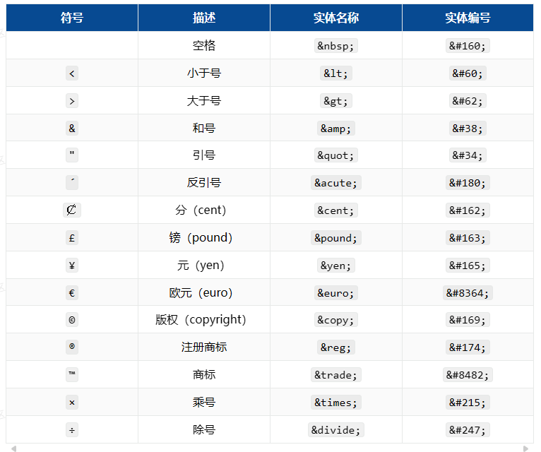

完整实体列表，请参考：[HTML Standard (whatwg.org)](https://html.spec.whatwg.org/multipage/named-characters.html#named-character-references)

## 七，HTML全局属性

常用的全局属性：

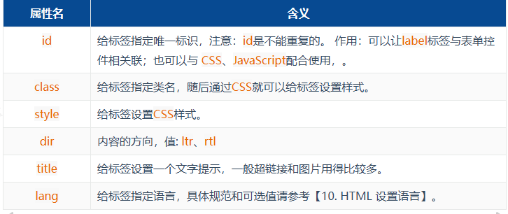

> 完整的全局属性，请参考：[全局属性 - HTML（超文本标记语言） | MDN (mozilla.org)](https://developer.mozilla.org/zh-CN/docs/Web/HTML/Global_attributes)

## 八，meta 元信息

- 配置字符编码

```html
<meta charset="utf-8">
```

- 针对IE浏览器的兼容性配置。

```html
<meta http-equiv="X-UA-Compatible" content="IE=edge">
```

- 针对移动端的配置（移动端课程中会详细讲解）

```html
<meta name="viewport" content="width=device-width, initial-scale=1.0">
```

- 配置网页关键字

```html
<meta name="keywords" content="8-12个以英文逗号隔开的单词/词语">
```

- 

```html
<meta name="robots" content="此处可选值见下表">
```

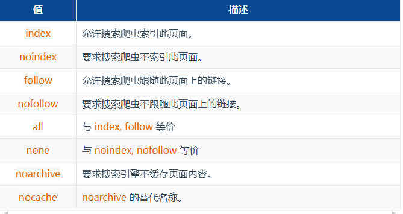

- 配置网页作者：

```html
<meta name="author" content="tony">
```

- 配置网页生成工具 

```html
<meta name="generator" content="Visual Studio Code">
```

- 配置定义网页版权信息：

```html
<meta name="copyright" content="2023-2027©版权所有">
```

- 配置网页自动刷新

```html
<meta http-equiv="refresh" content="10;url=http://www.baidu.com">
```

- 针对搜索引擎爬虫配置：

> 完整的网页元信息，请参考：[文档级元数据元素 | MDN](https://developer.mozilla.org/zh-CN/docs/Web/HTML/Element/meta)

## 九，HTML5

### 1. 什么是HTML5

- 
  HTML5 是新一代的 HTML 标准，2014年10月由万维网联盟（W3C）完成标准制定。
- 官网地址：
  - W3C提供： https://www.w3.org/TR/html/index.html
  - WHATWG提供：https://whatwg-cn.github.io/html/multipage
- HTML5在狭义上是指新一代的 HTML 标准，在广义上是指：整个前端。

### 2. HTML5 的优势

1. 针对JavaScript，新增了很多可操作的接口。
2. 新增了一些语义化标签、全局属性。
3. 新增了多媒体标签，可以很好的替代flash。
4. 更加侧重语义化，对于SEO更友好。
5. 可移植性好，可以大量应用在移动设备上

### 3. HTML5 的兼容性

支持：Chrome、Safari、Opera、Firefox 等主流浏览器。

> IE浏览器必须是9及以上版本才支持HTML5，且IE9仅支持部分HTML5新特性

## 十，H5新增语义化标签

### 1. 新增布局标签

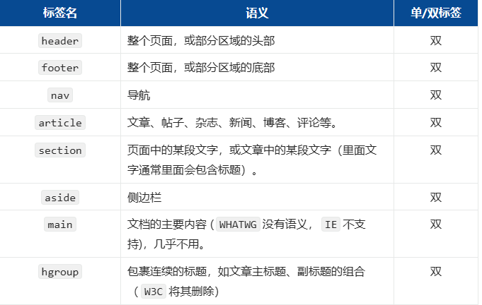

关于`article`和`section`：

> 1. artical里面可以有多个section。
> 2. section强调的是分段或分块，如果你想将一块内容分成几段的时候，可使用section元素。
> 3. article比section更强调独立性，一块内容如果比较独立、比较完整，应该使用article元素。

### 2. 新增状态标签

**meter标签**

- 语义：定义已知范围内的标量测量，又称： gauge（尺度），双标签，例如：电量、磁盘用量等。

- 常用属性如下：

  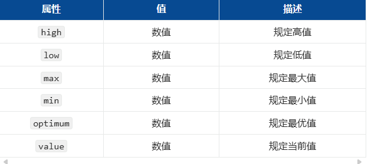

**progress 标签**

- 语义：显示某个任务完成的进度的指示器，一般用于表示进度条，双标签，例如：工作完成进度等。

- 常用属性如下：

  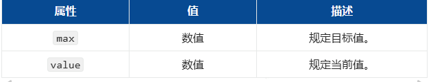

### 3. 新增列表标签

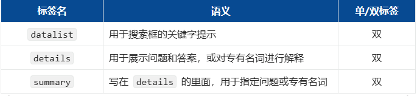

```html
<input type="text" list="mydata">
<datalist id="mydata">
    <option value="周冬雨">周冬雨</option>
    <option value="周杰伦">周杰伦</option>
    <option value="温兆伦">温兆伦</option>
    <option value="马冬梅">马冬梅</option>
</datalist>
```

```html
<details>
    <summary>如何走上人生巅峰？</summary>
    <p>一步一步走呗</p>
</details>
```

### 4. 新增文本标签

**文本注音**

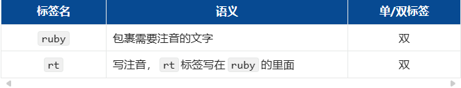

```html
<ruby>
    <span>魑魅魍魉</span>
    <rt>chī mèi wǎng liǎng </rt>
</ruby>
```

**文本标记**

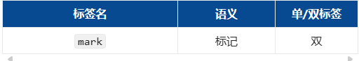

> 注意：W3C 建议 mark 用于标记搜索结果中的关键字。

## 十一，H5新增表单功能

### 1. 表单控件新属性

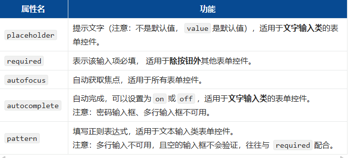

### 2. input 新增属性值

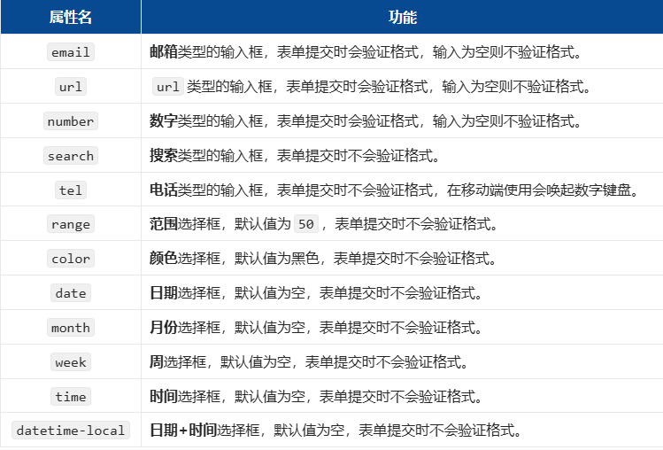

### 3. form 标签新增属性

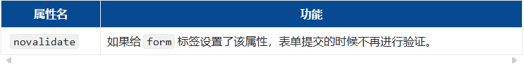

## 十二，H5新增多媒体标签

### 1. 视频标签

\<video>标签用来定义视频，它是双标签

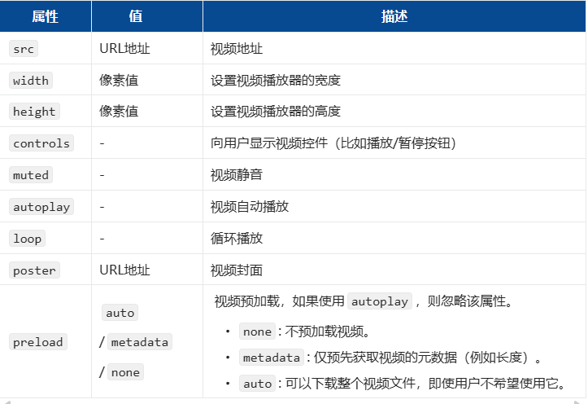

### 2. 音频标签

\<audio>标签用来定义音频，它是双标签

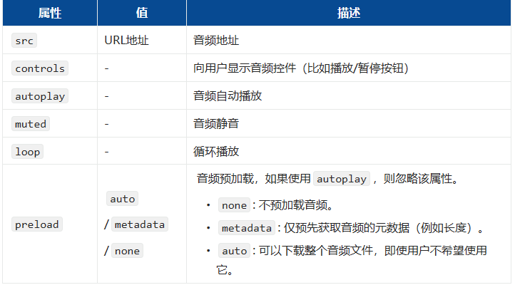

## 十三，H5新增全局属性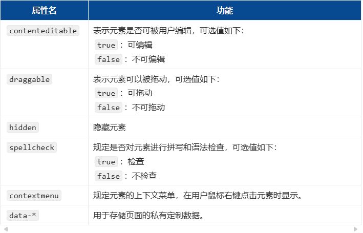

## 十四，H5兼容性处理

- 添加元信息，让浏览器处于最优渲染模式。

  ```html
  <!--设置IE总是使用最新的文档模式进行渲染-->
  <meta http-equiv="X-UA-Compatible" content="IE=Edge">
  
  <!--优先使用 webkit ( Chromium ) 内核进行渲染, 针对360等壳浏览器-->
  <meta name="renderer" content="webkit">
  ```

- 使用html5shiv让低版本浏览器认识H5的语义化标签。

  ```html
  <!--[if lt ie 9]>
  <script src="../sources/js/html5shiv.js"></script>
  <![endif]-->
  ```

- 扩展

  ```
  lt 小于
  lte 小于等于
  gt 大于
  gte 大于等于
  ! 逻辑非
  ```

- 示例

  ```html
  <!--[if IE 8]>仅IE8可见<![endif]--> 
  <!--[if gt IE 8]>仅IE8以上可见<![endif]—>
  <!--[if lt IE 8]>仅IE8以下可见<![endif]—>
  <!--[if gte IE 8]>IE8及以上可见<![endif]—>
  <!--[if lte IE 8]>IE8及以下可见<![endif]—>
  <!--[if !IE 8]>非IE8的IE可见<![endif]-->
  ```

  
