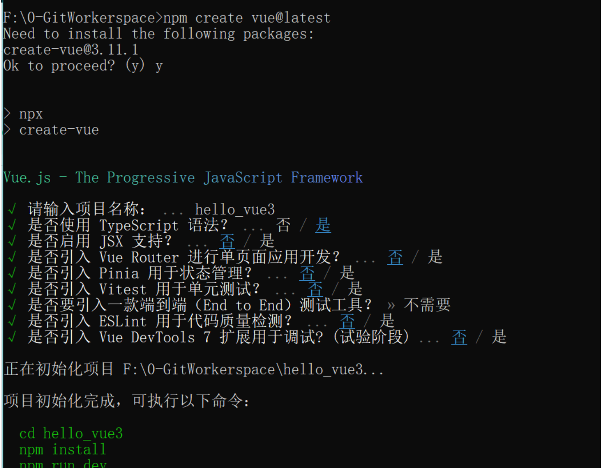
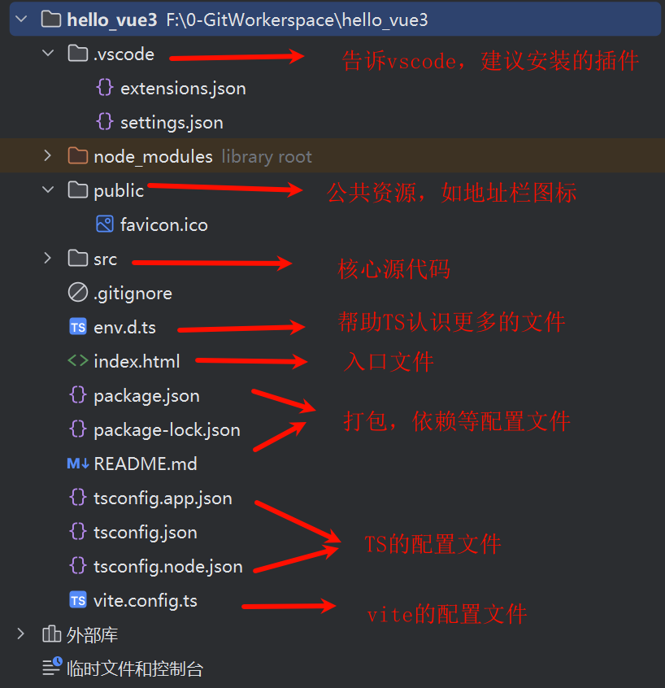
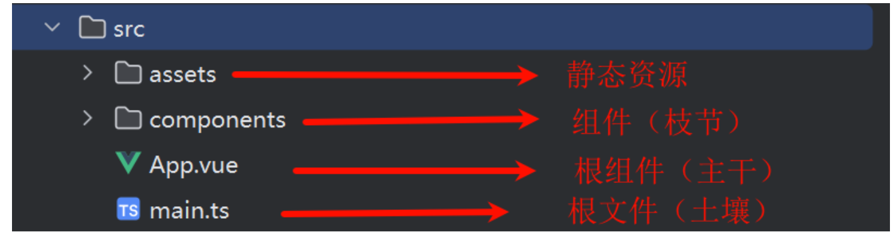
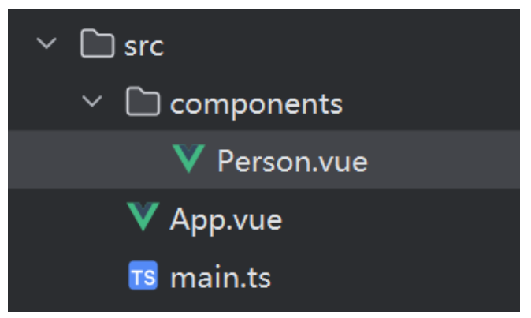
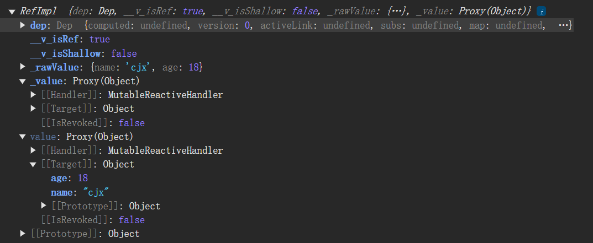

# 1. Vue3 工程的创建

## 1.1 【基于 vue-cli 创建】

点击查看[官方文档](https://cli.vuejs.org/zh/guide/creating-a-project.html#vue-create)

> 备注：目前`vue-cli`已处于维护模式，官方推荐基于 `Vite` 创建项目。

```powershell
## 查看@vue/cli版本，确保@vue/cli版本在4.5.0以上
vue --version

## 安装或者升级你的@vue/cli 
npm install -g @vue/cli

## 执行创建命令
vue create vue_test

##  随后选择3.x
##  Choose a version of Vue.js that you want to start the project with (Use arrow keys)
##  > 3.x
##    2.x

## 启动
cd vue_test
npm run serve
```

---

## 1.2 【基于 vite 创建】(推荐)

一行命令快速创建

```bash
npm create vue@latest
```




Vite 创建和 vue-cli创建的区别：

Vite是vue团队新开发的构建工具，vue-cli 是一个脚手架，使用的是webpack构建

简单来说，Vite更快。可参考下列对比图


**项目结构介绍**



**核心源代码目录**



总结：

1. 根目录下的index.html 作为入口文件，引入src下的main.ts 文件作为后续的解析文件
2. main.ts 中利用 createApp( )  函数创建 应用实例，且以App.vue 文件作为页面主干

## 1.3 简单的效果实现


利用选项式API 实现了组件引入，状态变量效果。

**文件结构**



**App.vue**

```vue
<script lang="ts">
import person from './components/Person.vue'

export default {
  name: 'App',
  components: {
    person
  }
}
</script>

<template>
  <div class="app">
    <person></person>
  </div>
</template>

<style scoped>
.app {
  padding: 20px;
  box-shadow: 0 4px 8px 0 rgba(0, 0, 0, 0.2), 0 6px 20px 0 rgba(0, 0, 0, 0.19);
  background-color: cyan;
  height: 100px;
  width: 100%;
}
</style>
```

**Person.vue**

```vue
<script lang="ts">
export default {
  name: "person",
  data() {
    return {
      name: "张三",
      age: 18,
      tel: '19987765672'
    }
  },
  methods: {
    changeName() {
      this.name = '李四'
    },
    addAge() {
      this.age += 1
    },
    showTel() {
      alert(this.tel)
    }
  }
}
</script>

<template>
  <div class="Person">
    <h1>姓名：{{ name }}</h1>
    <h1>年龄：{{ age }}</h1>
    <button @click="changeName">修改姓名</button>
    <button @click="addAge">增加年龄</button>
    <button @click="showTel">获取联系方式</button>
  </div>
</template>

<style scoped>
.Person {
  padding: 20px;
  text-align: center;
  box-shadow: 0 4px 8px 0 rgba(0, 0, 0, 0.2), 0 6px 20px 0 rgba(0, 0, 0, 0.19);
  background-color: #f77234;
}
</style>
```

# 2. Vue3 核心语法

## 2.1 选项式API 对比 组合式API

官方目前推荐使用组合式API，为什么？了解选项式API的缺点和组合式API的优点即可明确。

### 选项式API的弊端

根据之前的“简单的效果实现”中可以看出，选项式API的功能实现中，其数据，函数等等会散落在data，methods，computed中，新增，修改起来不方便。不利于维护和复用。

212929-6cc8b8b6-2c4a-4927-8226-65d1f1f4f337](Vue3核心用法.assets/1683166212929-6cc8b8b6-2c4a-4927-8226-65d1f1f4f337.gif)


### 组合式API优点

可以将功能的代码集合在一起，不会分散着各个区域中


## 2.2 setup 配置项

### setup概述

`setup`是`Vue3`中一个新的配置项，值是一个函数，它是 `Composition API` **“表演的舞台**_**”**_，组件中所用到的：数据、方法、计算属性、监视......等等，均配置在`setup`中。

特点如下：

- `setup`函数返回的对象中的内容，可直接在模板中使用。
- `setup`中访问`this`是`undefined`。
- `setup`函数会在`beforeCreate`之前调用，它是“领先”所有钩子执行的。

```vue
<script lang="ts" >
 export default {
   name: 'person',
   setup(){
     console.log(this) //setup中的this是undefined，Vue3在弱化this了
     let name = "张三"
     let age = 18
     let tel = '18892931241'
     function changeName(){
       name = '李四' // 修改值，页面为同步渲染
       console.log(name) // 确实修改了
     }
     function addAge(){
       age += 1
       console.log(age)
     }
     function showTel(){
       alert(tel)
     }
     // 模板中需要的数据和方法需要在return中导出
     return {name,age,changeName,addAge,showTel}
   }
 }
</script>

<template>
  <div class="Person">
    <h1>姓名：{{ name }}</h1>
    <h1>年龄：{{ age }}</h1>
    <button @click="changeName">修改姓名</button>
    <button @click="addAge">增加年龄</button>
    <button @click="showTel">获取联系方式</button>
  </div>
</template>

<style scoped>
.Person {
  padding: 20px;
  text-align: center;
  box-shadow: 0 4px 8px 0 rgba(0, 0, 0, 0.2), 0 6px 20px 0 rgba(0, 0, 0, 0.19);
  background-color: #f77234;
}
</style>
```

### setup返回值

- 若返回一个**对象**：则对象中的：属性、方法等，在模板中均可以直接使用**（重点关注）。**
- 若返回一个**函数**：则可以自定义渲染内容，代码如下：

```jsx
setup(){
  return ()=> '你好啊！'
}
```

### setup 与 选项式API的关系

1. 使用了setup函数依旧可以使用选项式API，且选项式API导出的数据和函数依旧可以使用。
2. setup中导出的数据和函数在选型式API中可以通过 this.xxx 的方式调用。
3. 选项式API 导出的数据 setup 函数中不能使用
4. 原因：setup的生命周期早于选项式API

### setup 语法糖

为了简化setup的写法，推出了setup语法糖。

```vue
<script  setup lang="ts" >
    // 数据
    let name = "张三"
    let age = 18
    let tel = '18892931241'
    // 方法
    function changeName(){
      name = '李四' // 修改值，页面为同步渲染
      console.log(name) // 确实修改了
    }
    function addAge(){
      age += 1
      console.log(age)
    }
    function showTel(){
      alert(tel)
    }
</script>
```

可以发现相比于使用setup函数，使用setup语法糖后无需什么setup函数，且无需返回模板中所需的数据以及方法。它们被默认返回。

**！** 但是，这中写法会导致组件名的定义也失效，组件名使用默认的文件名。

**方法1**：多加上一个script标签，专门导出组件名

```vue
<script lang="ts" >
 export default {
   name: 'person'
 }
</script>
```

**方法2**：使用setup扩展组件

1. 下载

   ```bash
   npm i vite-plugin-vue-setup-extend -D
   ```

2. vite.config.ts 中导入此插件

   ```ts
   import vueSetupExtend from 'vite-plugin-vue-setup-extend'
   export default defineConfig({
     plugins: [
       vue(),vueSetupExtend()
     ],
   })  
   ```

3. 使用name 属性配置组件名

   ```vue
   <script  setup lang="ts" name="Person123">
   ```

   

## 2.3 响应式数据

### ref 创建：基本类型的响应式数据

- **作用：**定义响应式变量。
- **语法：**`let xxx = ref(初始值)`。
- **返回值：**一个`RefImpl`的实例对象，简称`ref对象`或`ref`，`ref`对象的`value`**属性是响应式的**。
- **注意点：**
  - `JS`中操作数据需要：`xxx.value`，但模板中不需要`.value`，直接使用即可。
  - 对于`let name = ref('张三')`来说，`name`不是响应式的，`name.value`是响应式的。

```vue

<script  setup lang="ts" name="Person123">
    import {ref} from "vue";

    // 数据
    let name = ref("张三")
    let age = ref(18)
    let tel = '18892931241'

    // 原name值被作为RefImp的value属性值
    console.log(name)
    console.log(tel)

    // 方法
    function changeName(){
      name.value = '李四' // 修改值，页面为同步渲染
      console.log(name) // 确实修改了
    }
    function addAge(){
      age.value += 1
      console.log(age)
    }
    function showTel(){
      alert(tel)
    }
</script>

<template>
  <div class="Person">
    <h1>姓名：{{ name }}</h1>
    <h1>年龄：{{ age }}</h1>
    <button @click="changeName">修改姓名</button>
    <button @click="addAge">增加年龄</button>
    <button @click="showTel">获取联系方式</button>
  </div>
</template>

<style scoped>
.Person {
  padding: 20px;
  text-align: center;
  box-shadow: 0 4px 8px 0 rgba(0, 0, 0, 0.2), 0 6px 20px 0 rgba(0, 0, 0, 0.19);
  background-color: #f77234;
}
</style>
```

### reactive创建：对象类型的响应式数据

- **作用：**定义一个**响应式对象**（基本类型不要用它，要用`ref`，否则报错）

- **语法：**`let 响应式对象= reactive(源对象)`。

  - **返回值：**一个`Proxy`的实例对象，简称：响应式对象。

- **注意点：**`reactive`定义的响应式数据是“深层次”的。

  ```vue
  
  <script  setup lang="ts" name="Person123">
      import {reactive} from "vue";
  
      let car = reactive({name:'宝马',price:100})
      let games = reactive([
          {id:'game01',name:'英雄联盟'},
          {id:'game02',name:'穿越火线'},
          {id:'game03',name:'永劫无间'},
      ])
      // 深层次数据也可以改变
      let x = reactive({a:{b:{c:666}}})
  
      console.log(car)
  
      function changeCarPrice(){
        car.price += 10
      }
  
      function changeFirstGame(){
        games[0].name = 'Data2'
      }
  
      function changeDeep(){
        x.a.b.c = 888
      }
  
  </script>
  
  <template>
    <div class="Person">
      <h1>汽车品牌：{{car.name}},汽车价格：{{car.price}}万</h1>
      <button @click="changeCarPrice">增加汽车价格</button>
      <ul>
        <li v-for="game in games" :key="game.id">{{ game.name }}</li>
      </ul>
      <button @click="changeFirstGame">修改第一个游戏</button>
      <h1>{{x.a.b.c}}</h1>
      <button @click="changeDeep">修改深层次数据</button>
    </div>
  </template>
  
  <style scoped>
  .Person {
    padding: 20px;
    text-align: center;
    box-shadow: 0 4px 8px 0 rgba(0, 0, 0, 0.2), 0 6px 20px 0 rgba(0, 0, 0, 0.19);
    background-color: #f77234;
  }
  </style>
  ```

### ref 创建：对象类型的响应式数据

ref其实也可以创建对象类型，其原理还是调用了reactive方法。表现为其value值就是reactive的代理对象



### ref 对比 reactive

宏观角度看：

> 1. `ref`用来定义：**基本类型数据**、**对象类型数据**；
>
> 2. `reactive`用来定义：**对象类型数据**。

- 区别：

> 1. `ref`创建的变量必须使用`.value`（可以使用`volar`插件自动添加`.value`）。
> 2. volar VSCode插件
>
>  
>
> 2. `reactive`重新分配一个新对象，会**失去**响应式（可以使用`Object.assign`去整体替换）。

- 使用原则：

> 1. 若需要一个基本类型的响应式数据，必须使用`ref`。
> 2. 若需要一个响应式对象，层级不深，`ref`、`reactive`都可以。
> 3. 若需要一个响应式对象，且层级较深，推荐使用`reactive`。

## 2.4 toRefs 与 toRef

* 这两个东西为了解决什么问题？

> **场景**：定义了一个对象类型的响应式数据。如student。含name，age等属性。我使用解构表达式提取中name，age两个变量。所以，此时的name，age变量放在模板中还具有响应式数据的特点吗？
>
> **直接说**：没有，打印name，发现它成为了一个普通的基本类型数据。那么怎么解决呢？
>
> **答案**：使用toRefs，或者toRef函数。获取其返回值，即为响应式数据。不信可以打印其返回值观察

* `toRefs` 和 `toRef` 有什么区别

> **相同点**：用都是将响应式对象中的属性转换成`ref`对象
>
> **不同点**：`toRefs`是批量转换，转换出的是一个包含所有属性的对象。`toRef`是转换一个，需指定属性名

* 怎么用？

  `let {name,age} = toRefs(student)`

  `let age2 = toRef(student,'age')`

  直接看代码

  ```vue
  
  <template>
    <div class="Person">
      <h2>学生名字：{{ student.name }}</h2>
      <h2>学生年龄：{{ student.age }}</h2>
      <button @click="changeAge">年龄+1</button>
      <br>
      <h2>学生名字：{{ name }}</h2>
      <h2>学生年龄：{{ age }}</h2>
      <br>
      <h2>学生年龄：{{ age2 }}</h2>
    </div>
  
  </template>
  
  <script  setup lang="ts" >
  import { log } from "console";
  import { reactive, toRef, toRefs } from "vue";
  
    let student = reactive({
      name: "坤哥",
      age: 2.5
    })
    // let {name,age} = student
    let {name,age} = toRefs(student)
    console.log(name);
    console.log(age);
      
     
    let age2 = toRef(student,'age')
    
  
    function changeAge(){
      student.age += 1
    }
  
  
  </script>
  
  <style scoped>
  .Person {
    padding: 20px;
    text-align: center;
    box-shadow: 0 4px 8px 0 rgba(0, 0, 0, 0.2), 0 6px 20px 0 rgba(0, 0, 0, 0.19);
    background-color: #f77234;
  }
  </style>
  ```

  

## 2.5 computed

* `computed`有什么用？

  > **场景**：两个输入框，一个姓，一个名。最后拼起来展示其全名。很简单吧，库库操作后，大概率使用两个变量记录姓和名，最后在展示全名时利用`{{}}`来展示。
  >
  > **需求升级**：但如果我要姓的第一个字母必须大写呢？那马上就头大了，可能是要在`{{}}`中搞一堆的操作，取第一个字符，转换大写，再去除第一个字符的其他部分，最后再拼写出来。这是不是在`{{}}`中搞得太复杂了呢😂。
  >
  > **所以**：你可以利用computed来将刚刚的复杂逻辑放入computed函数形参中作为返回值。再把返回值拿去用。
  >
  > **tips**：Vue3中computed以函数的形式使用。Vue2中是一个选项

* `computed`怎么用？

  > 1. 把你的计算OR关于数据的业务逻辑写在computed函数形参中
  > 2. 把最后结果返回
  > 3. 使用一个变量接收。此结果会根据computed中所依赖的数据变化而变化。且有缓存特点，可以说：一次计算，处处使用。（当然，前提是所依据的数据没变化）

  `let fullName = computed(()=> {
      return firstName.value.slice(0,1).toUpperCase() + firstName.value.slice(1)+'-'+lastName.value
    })`

* 参考代码

  ```vue
  
  <template>
    <div class="Person">
      <h2>姓：{{ firstName }}</h2>
      <h2>名：{{ lastName }}</h2>
       <!-- <h2>姓名：{{ firstName + '--' + lastName }}</h2> -->
       <!-- 现在改成首字母大写 -->
      <!-- <h2>姓名：{{ firstName.slice(0,1).toUpperCase() + firstName.slice(1) + '-' + lastName }}</h2> -->
      <!-- computed解决 -->
       <h2>姓名：{{ fullName }}</h2>
  
  
    </div>
  
  </template>
  
  <script  setup lang="ts" >
  import { log } from "console";
  import { computed, reactive, ref, toRef, toRefs } from "vue";
  
    let firstName = ref('cai')
    let lastName = ref('xukun')
  
    // 使用computed计算属性
    let fullName = computed(()=> {
      return firstName.value.slice(0,1).toUpperCase() + firstName.value.slice(1)+'-'+lastName.value
    })
    console.log(fullName);
  
  </script>
  
  <style scoped>
  .Person {
    padding: 20px;
    text-align: center;
    box-shadow: 0 4px 8px 0 rgba(0, 0, 0, 0.2), 0 6px 20px 0 rgba(0, 0, 0, 0.19);
    background-color: #f77234;
  }
  </style>
  ```

  * computed 返回的变量是只读的

    > **怎么理解？**
    >
    > 意思是返回的变量是无法通过赋值的方式来改变。只能通过其依据的变量改变而改变。
    >
    > **怎么让其可读？**
    >
    > ```vue
    > <script lang="ts" setup name="Person">
    >     // fullName是一个计算属性，可读可写
    >   	let fullName = computed({
    >     // 当fullName被读取时，get调用
    >     get(){
    >       return firstName.value.slice(0,1).toUpperCase() + firstName.value.slice(1) + '-' + lastName.value
    >     },
    >     // 当fullName被修改时，set调用，且会收到修改的值
    >     set(val){
    >       const [str1,str2] = val.split('-')
    >       firstName.value = str1
    >       lastName.value = str2
    >     }
    >   })
    > </script>
    > ```
    >
    > 


