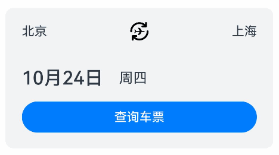

# 地址动画交换

**效果演示：**



**使用说明：**

点击小飞机图标，左右两侧地址文字做动画位置平移切换。小飞机图标周围图片圈作旋转动画。

**技术支持：**

1. animateTo接口  实现属性动画。
2. animation属性实现属性动画
3. translate属性 设置属性平移，作为文字移动动画的参数
4. stack组件 实现中心图片组合效果
5.  rotate 属性对象值的 angle 控制图片旋转角度

**实现思路：**

1. 布局思路：

   - 面向组件开发，所有最外层容器可以给一个百分比宽度和定好的高度
   - 设定一个容器内容宽度变量，方便给内容容器设置宽度。且内容容器也设置高度。这样容器的大小会更按照思路走，人为控制
   - 文字栏利用百分比+文字排列方式来布局，一个之前不会的思路

   

2. 文字平移动画：
   - 利用translate实现。之前思路为offset，但translate更好控制平移的大小。

3. 图片组合：
   - 堆叠容器实现

**参考代码**

```js
import { curves, promptAction } from '@kit.ArkUI'

@Entry
@Component
struct Index {
  //是否已交换
  @State isSwap: boolean = false;
  // X轴偏移量
  @State translateX: number = 0;
  // 旋转角度
  @State rotateAngle: number = 0
  // 整体内容区宽度
  private rowWidth: number = 300;

  build() {
    Column({ space: 15 }) {
      // 地址栏
      Row() {
        Text('北京')
          .width('40%')
          .translate({ x: this.translateX })
          .textAlign(this.isSwap ? TextAlign.End : TextAlign.Start)
        // 层叠图片
        Stack() {
          Image($r('app.media.address_exchange_recycle'))
            .width(28)
            .rotate({ angle: this.rotateAngle })
            // animation 实现图片动画
            .animation({
              curve: curves.springMotion(),
              playMode: PlayMode.Normal
            })
          Image($r('app.media.address_exchange_airplane')).width(16)
        }
        .width('20%')
        .onClick(_ => {
          this.isSwap = !this.isSwap
          animateTo({duration: 500 , curve: Curve.Linear},()=>{
          this.translateX = this.isSwap ? 180 : 0
          })
          this.rotateAngle += 180
        })

        Text('上海')
          .width('40%')
          .translate({ x: -this.translateX })
          .textAlign(this.isSwap ? TextAlign.Start : TextAlign.End)
      }.width(this.rowWidth).height(60)

      // 日期显示
      Row({ space: 20 }) {
        Text('10月24日').fontSize(24).fontWeight(500).height(30)
        Text('周四').fontSize(18).height(30)
      }.width(this.rowWidth)

      // 按钮
      Button('查询车票')
        .width(this.rowWidth)
        .height(40)
        .onClick(_ => {
          promptAction.showToast({
            message: "演示效果，业务未实现",
          })
        })
    }
    .backgroundColor('#F2F3F5')
    .borderRadius(10)
    .height('180')
    .width('95%')
    .margin(10)
  }
}
```

