# VitePress 建立文档网站

## 搭建项目

1. 创建一个你喜欢的英文文件夹

   如：F:\0-GitWorkerspace\document

2. 打开此文件夹的cmd控制台检查是否安装 node.js 和 pnpm 。如果没安装自行搜索安装

   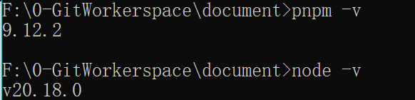

3. 下载项目

   下载指令

   ```bash
   pnpm add -D vitepress
   ```

   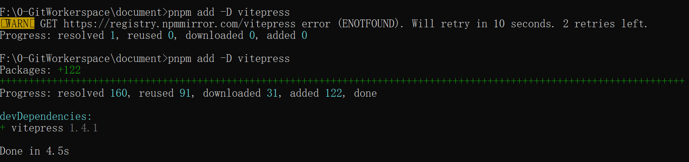

4. 初始化项目

   ```bash
   pnpm vitepress init
   ```

   初始化后的具体配置可按下选择

   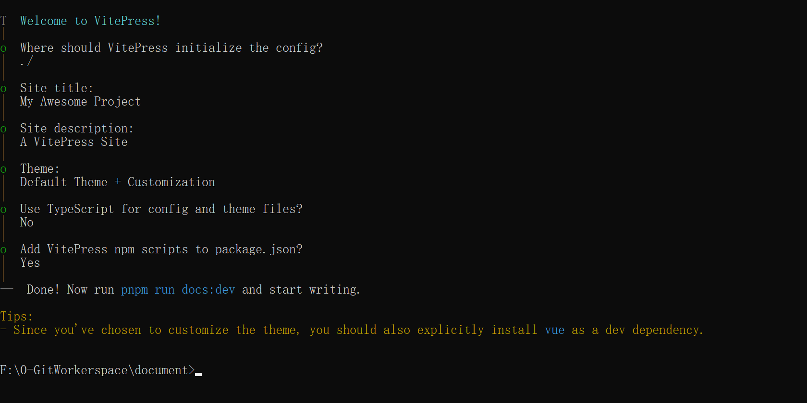

5. 启动项目

   ```bash
   pnpm run docs:dev
   ```

   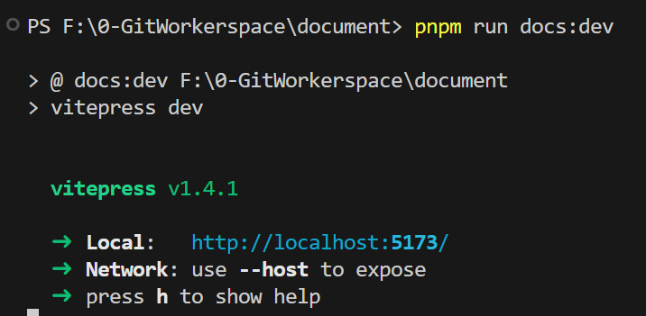

   启动成功后的效果。可访问网址查看效果

## 主页美化

主页美化涉及的配置为： 1. 标题 2. 描述 3. 文本域 4. 导航栏 5. 社交图标

在两个文件中配置即可：config.mjs 和 index.md

可参考如下代码

`config.mjs` 

```js
import { defineConfig } from 'vitepress'

// https://vitepress.dev/reference/site-config
export default defineConfig({

  // 主页小标题
  title: "陳序源个人文档库",
 // SEO 描述
  description: "编程 java 项目 前端 鸿蒙 HarmonyOS 计算机 计算机网络 数据库",

  themeConfig: {
    // https://vitepress.dev/reference/default-theme-config
    // 导航栏配置
    nav: [
      // 无下拉框
      { text: '主页', link: '/' },
      // 有下拉框
      { text: '项目', items:[
        { text: '星星交友', link: '/'},
        { text: '彗星AI刷题平台', link: '/'},
        { text: '恒星API调度平台', link: '/'},
      ] }
    ],

    sidebar: [
      {
        text: 'Examples',
        items: [
          { text: 'Markdown Examples', link: '/markdown-examples' },
          { text: 'Runtime API Examples', link: '/api-examples' }
        ]
      }
    ],

    // 最右侧的社交链接
    socialLinks: [
      { icon: 'github', link: 'https://github.com/chenjx0395' }
    ],

    // 底部自定义内容
    footer:{
      copyright: "Copyright @ 2024-present 陳序源"
    }

  }
})

```

`index.md`

```md
---
# https://vitepress.dev/reference/default-theme-home-page
layout: home

hero:
  # 主页标题
  name: "陳序源个人文档库"
  # 主页描述
  text: "记录编程学习产生的文档&笔记"
  # 标语 -- 更小的文本
  tagline: 人本自然，无为而生
  # 按钮
  actions:
    # 按钮样式
    - theme: brand
      # 按钮文本内容
      text: 项目
      # 点击后跳转的页面
      link: https://www.baidu.com
    - theme: alt
      text: 笔记
      link: /api-examples
# 块状的文本区域
features:
  # 文本域标题
  - title: 星星交友
    # 文本域描述
    details: 致力于打造以兴趣和目标为驱动的交友平台
  - title: 彗星AI刷题平台
    details: 智慧化刷题造题平台，为创造减负
  - title: 恒星API调度平台
    details: 提供高性能的API调用服务
---


```

## 主页图片

创建一个public文件夹用于存放图片

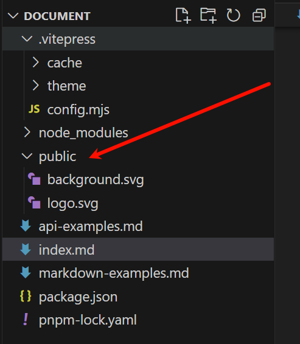

主页背景图

index.md 内配置

```md
hero:
  # 背景图
  image: 
    # 读取的是public内的文件。原因：未知
    src: background.svg
    alt: background
```

主页左侧logo

config.mjs 内配置

```js
export default defineConfig({
  themeConfig: {
    // https://vitepress.dev/reference/default-theme-config
    // logo 配置
    logo: '/public/logo.svg',
  }
})   
```

## 搜索栏配置

 config.mjs  文件中增加配置项

themeConfig配置内

```js
 // 配置搜索栏
    search: {
      provider: "local",
      options: {
        translations: {
          button: {
            buttonText: "搜索文档",
            buttonAriaLabel: "搜索文档"
          },
          modal: {
            noResultsText: "无法找到相关结果",
            resetButtonTitle: "清除查询条件",
            footer: {
              selectText: "选择",
              navigateText: "切换"
            }
          }
        }
      }
    },
```

## 侧边栏配置

 config.mjs 的 themeConfig 中配置

左侧侧边栏的原生配置方式为：

```js
// 修改左侧侧边栏，也是可有下拉配置
     sidebar: [

      {
        text: '项目',
        items: [
          { text: '星星交友', link: '/markdown-examples' },
          { text: '彗星AI刷题平台', link: '/api-examples' },
          { text: '恒星API调度平台', link: '/api-examples' },
        ]
      },
      {
        text: '后端',
        items: [
          { text: 'Java核心语法', link: '/markdown-examples' },
          { text: 'MySQL数据库', link: '/api-examples' },
          { text: 'Redis', link: '/api-examples' },
        ]
      },

    ], 
```

这种方式有些繁琐，所以提供一个脚本来快捷生产侧边栏

项目根目录下参加如下文件夹以及文件

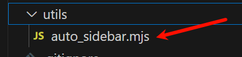

其代码为：

```js
import path from "node:path";
import fs from "node:fs";

// 文件根目录
const DIR_PATH = path.resolve();
// 白名单,过滤不是文章的文件和文件夹
const WHITE_LIST = [
  "index.md",
  ".vitepress",
  "node_modules",
  ".idea",
  "assets",
];

// 判断是否是文件夹
const isDirectory = (path) => fs.lstatSync(path).isDirectory();

// 取差值
const intersections = (arr1, arr2) =>
  Array.from(new Set(arr1.filter((item) => !new Set(arr2).has(item))));

// 把方法导出直接使用
function getList(params, path1, pathname) {
  // 存放结果
  const res = [];
  // 开始遍历params
  for (let file in params) {
    // 拼接目录
    const dir = path.join(path1, params[file]);
    // 判断是否是文件夹
    const isDir = isDirectory(dir);
    if (isDir) {
      // 如果是文件夹,读取之后作为下一次递归参数
      const files = fs.readdirSync(dir);
      res.push({
        text: params[file],
        collapsible: true,
        items: getList(files, dir, `${pathname}/${params[file]}`),
      });
    } else {
      // 获取名字
      const name = path.basename(params[file]);
      // 排除非 md 文件
      const suffix = path.extname(params[file]);
      if (suffix !== ".md") {
        continue;
      }
      res.push({
        text: name,
        link: `${pathname}/${name}`,
      });
    }
  }
  // 对name做一下处理，把后缀删除
  res.map((item) => {
    item.text = item.text.replace(/\.md$/, "");
  });
  return res;
}

export const set_sidebar = (pathname) => {
  // 获取pathname的路径
  const dirPath = path.join(DIR_PATH, pathname);
  // 读取pathname下的所有文件或者文件夹
  const files = fs.readdirSync(dirPath);
  // 过滤掉
  const items = intersections(files, WHITE_LIST);
  // getList 函数后面会讲到
  return getList(items, dirPath, pathname);
};
```

使用方式：

1. 先在config.mjs 中引入

   ```js
   import { set_sidebar } from '../utils/auto_sidebar.mjs
   ```

2. 引入后替换之前的写法，采用以下写法

   ```js
    // 脚本自动生成侧边栏
       sidebar: { 
       "/backend/java_basic":set_sidebar("/backend/java_basic"), 
         "/backend/mysql": set_sidebar("/backend/mysql"), 
         "/book/图解TCP_IP": set_sidebar("/book/图解TCP_IP"), 
       },
   ```

## 配置地址栏图标

直接在 config.mjs 中配置

```js
// 地址栏logo
  head :[["link",{rel: "icon", href: "/logo.svg"}]],
```

如果配置了base 则需要将base值添加至路径中

# Github Page 部署

## 创建仓库


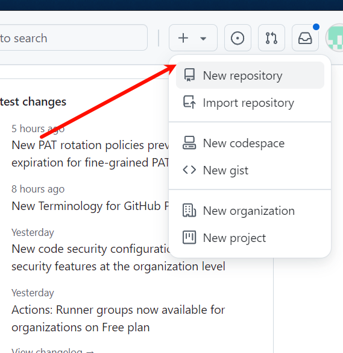

填写仓库名即可

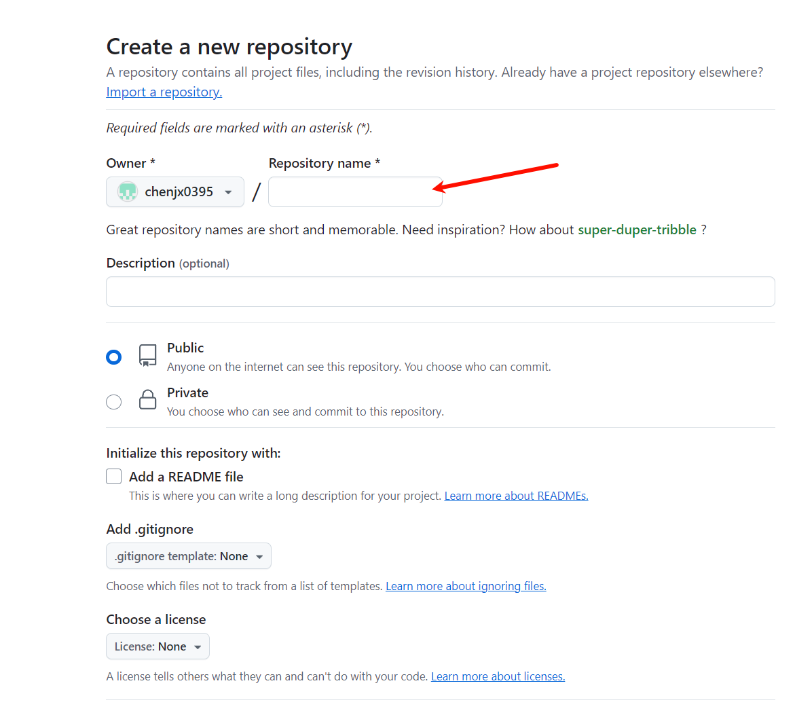

## 配置page

选择Actions，利用工作流自动部署

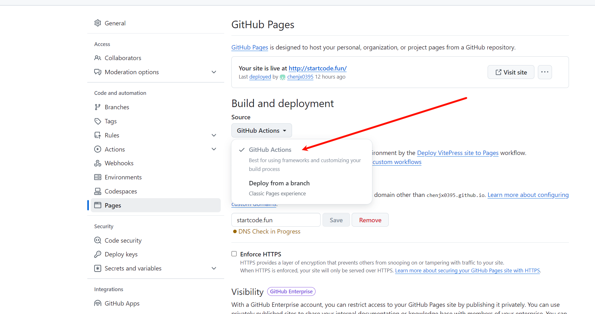

## 上传代码

1. 因为GitHub自动生成的域名会含其仓库名的路径，所以需要增加base

```js
base: "/docs/"
```

注意 地址栏logo 地址也要修改

2. 初始化git仓库

   ```js
   git init
   ```

3. 在项目根目录 添加gitgnore文件

   ```
   node_modules
   .DS_Store
   dist
   dist-ssr
   cache
   .cache
   .temp
   *.local
   ```

4. 添加本地所有文件到暂存区

   ```
   git add .
   ```

5. 提交到本地仓库

   ```
   git commit -m "first commit"
   ```

6. 添加远程仓库地址到本地

   ```
   git remote add origin 
   // 网址填自己的
   https://github.com/chenjx0395/docs.git
   ```

7. 推送项目

   ```
   git push -u origin master （不一定是master分支，现在GitHub是main分支了）
   ```

## 设置工作流

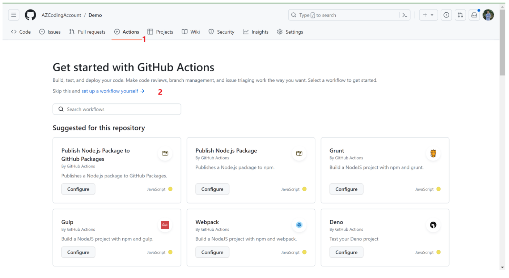 

1. 重命名并设置deploy脚本

    脚本文件：参考的vitepress官方文档：https://vitepress.dev/guide/deploy#github-pages 

```yaml
name: Deploy VitePress site to Pages

on:
  push:
    branches: [main]

# 设置tokenn访问权限
permissions:
  contents: read
  pages: write
  id-token: write

# 只允许同时进行一次部署，跳过正在运行和最新队列之间的运行队列
# 但是，不要取消正在进行的运行，因为我们希望允许这些生产部署完成
concurrency:
  group: pages
  cancel-in-progress: false

jobs:
  # 构建工作
  build:
    runs-on: ubuntu-latest
    steps:
      - name: Checkout
        uses: actions/checkout@v3
        with:
          fetch-depth: 0 # 如果未启用 lastUpdated，则不需要
      - name: Setup pnpm
        uses: pnpm/action-setup@v2 # 安装pnpm并添加到环境变量
        with:
          version: 8.6.12 # 指定需要的 pnpm 版本
      - name: Setup Node
        uses: actions/setup-node@v3
        with:
          node-version: 18
          cache: pnpm # 设置缓存
      - name: Setup Pages
        uses: actions/configure-pages@v3  # 在工作流程自动配置GithubPages
      - name: Install dependencies
        run: pnpm install # 安装依赖
      - name: Build with VitePress
        run: |
          pnpm run docs:build # 启动项目
          touch .nojekyll  # 通知githubpages不要使用Jekyll处理这个站点，不知道为啥不生效，就手动搞了
      - name: Upload artifact
        uses: actions/upload-pages-artifact@v2  # 上传构建产物
        with:
          path: .vitepress/dist # 指定上传的路径，当前是根目录，如果是docs需要加docs/的前缀

  # 部署工作
  deploy:
    environment:
      name: github-pages
      url: ${{ steps.deployment.outputs.page_url }} # 从后续的输出中获取部署后的页面URL
    needs: build    # 在build后面完成
    runs-on: ubuntu-latest  # 运行在最新版本的ubuntu系统上
    name: Deploy
    steps:
      - name: Deploy to GitHub Pages
        id: deployment  # 指定id
        uses: actions/deploy-pages@v2 # 将之前的构建产物部署到github pages中
```

脚本要注意分支名，且npm部署和pnpm部署有较大区别。我使用的是pnpm部署

 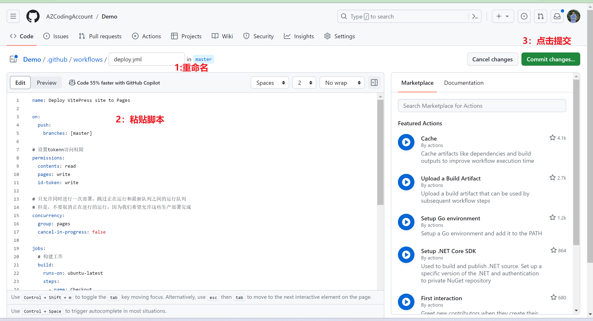 

## 解决CSS无样式问题

本地添加 .nojekyll 文件后push一下

## 自定义域名


如下添加记录

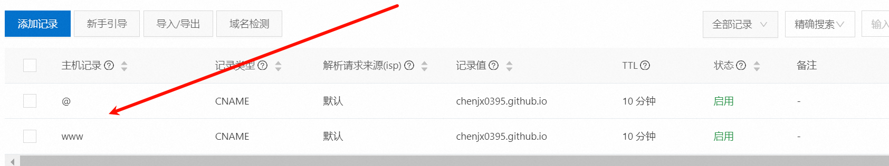

在GitHub上绑定对应域名


最后注意删除base值和logo的base值

