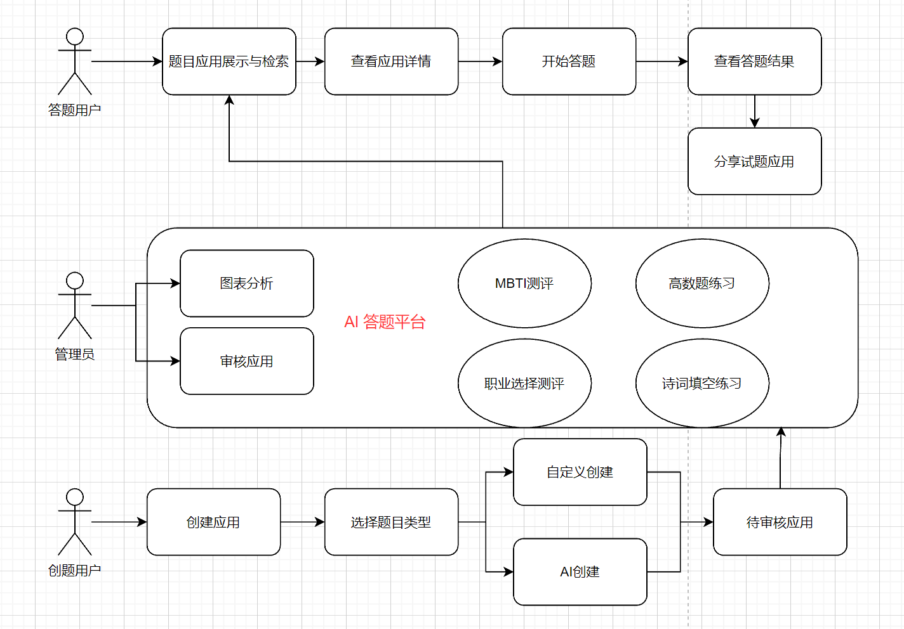

#  项目介绍

该项目基于 Vue3 + SpringBoot + Redis + ChatGLM AI + RxJava + SSE 实现的 **AI答测平台**。

- 支持试题应用检索，分享。
- 用户可以在答题类型刷题，也可以使用测评类型测评。测评基于管理员设定和AI测评两类方式给出结果。
- 用户可以自己设定或者基于AI快速生成试题应用。
- 管理员可以审核，集中管理试题应用。且具有统计分析功能

# 架构设计

## 核心业务架构图

# 需求分析

## 后端

- 用户模块
  - 用户注册
  - 用户登陆
  - 手机号登录
  - 修改用户信息
  - 注销用户
  - 

* 题目模块
  * 新增题目
  * 修改题目
  * 删除题目

* 